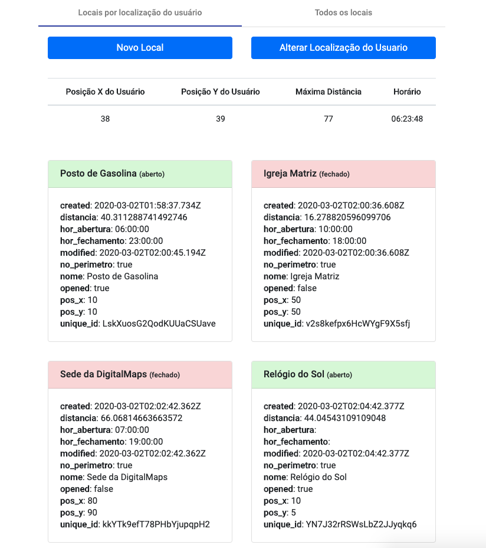
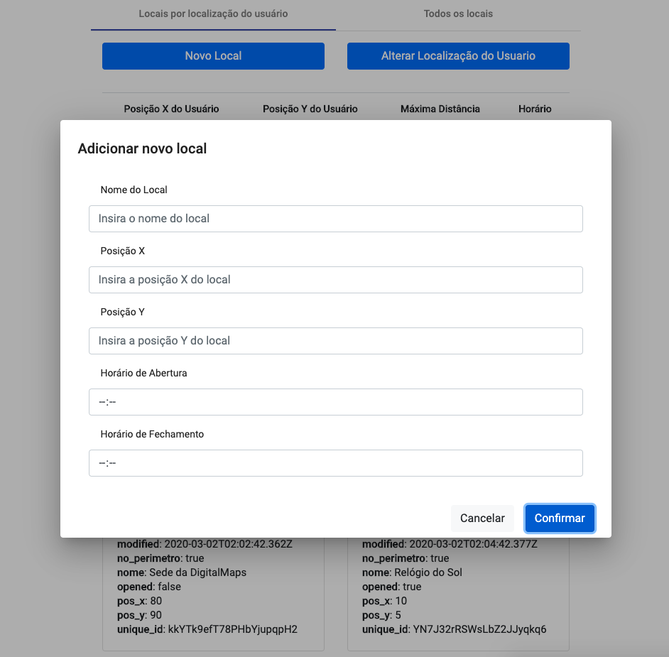
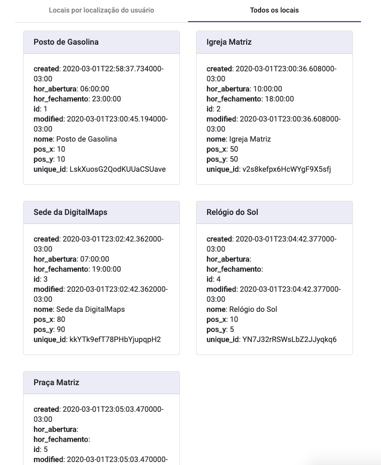
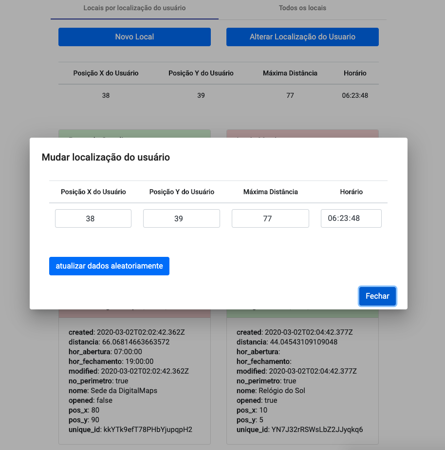

# Magalu Digital Maps
---

Este projeto tem por finalidade criar e consumir uma API REST na qual é possível cadastrar localizações com nome, posição x, posição y e horário de funcionamento (abertura e fechamento, opcionais).


Página Inicial             |  Adicionando novo local
:-------------------------:|:-------------------------:
  |  

   Todos os locais         |  Alterando posição do usuário
:-------------------------:|:-------------------------:
  |  


## Configurando Backend em Django

### Requisitos:
  - Python >= versão 3.6
  - PostgreSQL >= versão 10

### Como preparar o projeto
#### Postgres:

Criar uma base postgres. Em seguida alterar, dentro do arquivo `Backend/digitalmaps_backend/settings.py`, as chaves do dicionário "DATABASES" de acordo com a necessidade:
- **NAME**: nome da database em postgres (padrão: 'digitalmaps')
- **USER**: nome do usuário dono da base (padrão: 'postgres')
- **PASSWORD**: senha do usuário dono da base (padrão: 'magalu')
- **HOST**:  URL do local da base (padrão: 'localhost')
- **PORT**:  porta alocada para acessar a database no host (padrão: '5432')

Lembrando que é possível iniciar uma base postgres já com as configurações padrões via docker seguindo as instruções do arquivo `Backend/postgres/leiame.md`

#### Python/Django:

Instalar python versão igual ou superior a 3.6.
Verificar instalação do Pip, utilizando o comando `python3 -m pip --version`. 
Caso o pip não esteja instalado, instalar usando: `curl https://bootstrap.pypa.io/get-pip.py -o get-pip.py` e após, `python3 get-pip.py`

Navegue até o diretório `Backend` e instale as dependências do projeto utilizando `python3 -m pip install -r requirements.txt`.
Verifique se as dependências foram corretamente instaladas com `python3 -m pip freeze`. Caso os mesmos nomes do arquivo requirements.txt estejam na saída do comando executado acima, está tudo certo.

Ainda na pasta `Backend`, execute `python3 manage.py migrate` para aplicar todas as mudanças no banco de dados necessário para rodar a aplicação.
Após aplicar os migrations, execute `python3 manage.py loaddata initial_data.json` para carregar no banco de dados, informações pré cadastradas. Por padrão é criado um superusuário do Django com:
 - **Username**: admin
 - **Password**: magalu

Com todos os passos realizados, execute o servidor django com `python3 manage.py runserver 0:8000`, que iniciará na máquina do usuário um servidor de rede interna na porta 8000 para ser consumido.

Para verificar as informações cadastradas no banco de dados, acesse `http://localhost:8000/admin` e forneça as credenciais acima. Clicando em 'localizações' é possível ver, editar e remover entradas do banco de dados sem precisar utilizar o PGAdmin ou Psql. (com isso também é possível migrar bases de dados facilmente)

---

## Configurando Frontend em Angular

### Requisitos:
  - Node >= versão 8.9

### Como preparar o projeto
#### Node/NPM:

- Instalar Node.JS através do seguinte link: https://nodejs.org/en/download/
- Por padrão o NPM é instalado junto com node.JS, atualizar o npm com o comando `npm install npm@latest -g` no terminal.
 
#### Angular:
Navegue até o diretório `Frontend` e execute o comando `npm install` no terminal. Automaticamente devem ser baixadas as dependências necessárias para executar o projeto em frontend. Existe a possibilidade de ser necessário executar com permissões de usuário elevadas.

Dentro do arquivo `Frontend/src/environments/environment.ts`, altere o valor da chave 'backend' para o endereço do host backend em python anteriormente iniciado (por padrão em `localhost:8000`)

Navegue até a pasta `Frontend` e execute o comando `ng serve --host 0.0.0.0` para iniciar a interface frontend. Por padrão ela será iniciada na porta 4200. É possível pode acessar a interface gráfica por padrão pela url `localhost:4200`.

---

## Como utilizar o programa

A interface gráfica do projeto tem duas abas principais: "Locais por localização do usuário" e "Todos os locais".

Na primeira aba `Locais por localização do usuário` é possível simular o comportamento de uma aplicação na qual o usuário tem um ponto de localização (x e y) e gostaria de saber quais locais estão disponíveis dado um raio de distância máxima (mts) em dado horário.

Para alterar os dados do usuário, basta clicar em "**Alterar localização do usuário**" e modificar de acordo com a necessidade. 
**Lembrando**: Dado uma distância máxima, **nem todos os locais serão listados**, pois não estarão no raio de interesse do usuário. (Caso a distância máxima seja absurdamente grande, provavelmente todos os locais serão listados).

Para consumo da API de backend para listagem dos locais, é possível via requisições GET, no seguinte formato

```
GET localhost:8000/locais/user?pos_x=10&pos_y=10&mts=10&hr=10:00:00
```
onde:
 - 'pos_x'  é um número inteiro positivo
 - 'pos_y' é um número inteiro positivo
 - 'mts' é um número inteiro positivo
 - 'hr' é uma string em formato 'hh:mm:ss' onde hh representa horas, mm minutos, ss segundos.

Ainda na primeira aba, é possível cadastrar novas localizações clicando sobre o botão "**Novo Local**". É necessário colocar nome, posição x, posição y e os horários de abertura ou fechamento são opcionais. Caso algum deles seja preenchido errado, ou deixado vazio, eles são salvos em branco e é admitido que não há horário de funcionamento (sempre aberto).

Para consumo da API de backend para registro de novos locais, é possível via requisição POST no seguinte formato:

```
POST localhost:8000/locais/

{
	"nome": "Museu",
	"pos_x": 42,
	"pos_y": 78,
	"hor_abertura": "08:00:00",
	"hor_fechamento": "18:00:00"
}
```

onde:
 - 'nome' é uma string
 - 'pos_x'  é um número inteiro positivo
 - 'pos_y' é um número inteiro positivo
 - 'hor_abertura' é uma string em formato 'hh:mm:ss' onde hh representa horas, mm minutos, ss segundos.
 - 'hor_fechamento' é uma string em formato 'hh:mm:ss' onde hh representa horas, mm minutos, ss segundos.
 

Na segunda aba `Todos os locais` é possível listar todos os locais cadastrados no banco de dados.

O método para recuperação destas informações é via Django Rest Framework, diferentemente do 'request do usuário', que foi codificado manualmente. A ideia de futura melhoria seria utilizar os filtros e listagens pré-existentes para buscar e dar manutenção mais facilmente a medida que a aplicação cresça.

Para consumo da API de backend para listar todos os locais, é possível via requisição GET no seguinte formato:

```
GET localhost:8000/locais/?nome__icontains=
```
